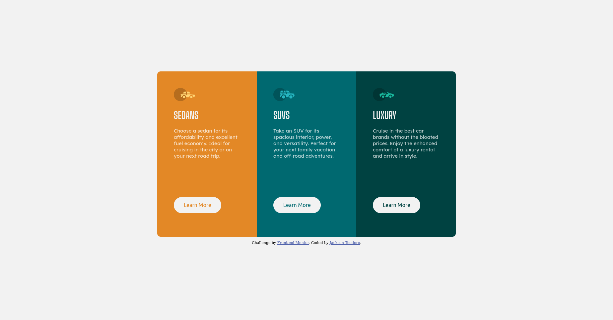

# Frontend Mentor - 3-column preview card component solution

This is a solution to the [3-column preview card component challenge on Frontend Mentor](https://www.frontendmentor.io/challenges/3column-preview-card-component-pH92eAR2-).
### Screenshot

### Links

- Solution URL: [Frontend Mentor](https://www.frontendmentor.io/solutions/3column-preview-card-component-solution-MygMxYv_S)
- Live Site URL: [Github Pages](https://jacksonvictor.github.io/3-column-preview-card-component-challenge-hub/)
### Built with

- Semantic HTML5 markup
- CSS custom properties
- Flexbox
- Media Queries
